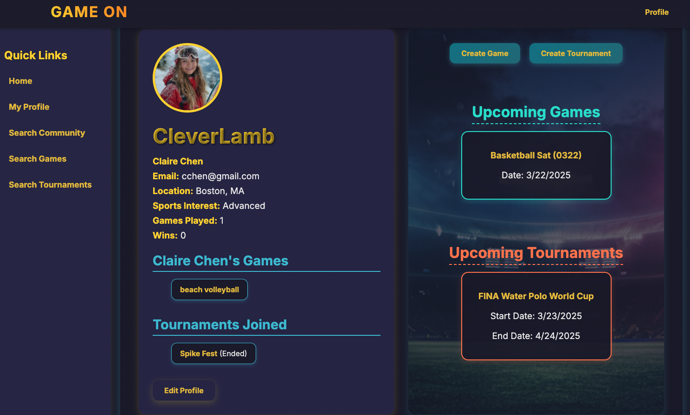

# Game On Sports Connect

**Game-On: Bridging Passion and Reality**

[ [Start App From Here](https://game-on-7e67046190a3.herokuapp.com/)]

Growing up, I dreamed of being a professional athlete—gliding through the water as a competitive swimmer or carving the ice in a high-stakes hockey game. The thrill of competition, the camaraderie of the sport, and the relentless pursuit of excellence were ingrained in me. But life took me on a different path. I studied math and statistics, diving deep into numbers rather than into the pool. Yet, the fire of that dream never truly faded.

**The Vision**
Game-On is born from this unwavering passion. It is an app designed to help those who still carry the dream of professional sports in their hearts but have taken different paths in life. Whether you're an aspiring athlete, a weekend warrior, or someone looking to rekindle your love for the game, Game-On brings together a community where passion meets opportunity. 

Whether you're looking to join a casual game, compete in a tournament, or connect with a vibrant community of players, this platform has it all. With a sleek, sporty design and interactive features, Game On Sports Connect makes it easy to explore, participate, and showcase your athletic achievements.

## Screenshots
**Home Page**

**Profile Page**

**Community Page**

**Game Page**

## Features
- **User Profiles**: Create and edit personalized profiles with full name, location, sports interests, profile pictures, and highlight videos.
- **Games & Tournaments**: Discover, join, and create upcoming games and tournaments with details like location, time, skill level, and participant limits.
- **Community Hub**: Browse a list of community members, view their profiles, and connect with fellow sports lovers.
- **Highlight Videos**: Share and like video highlights with an interactive heart (❤️) system.
- **Responsive Design**: Enjoy a seamless experience across devices with a modern, visually appealing interface.
- **Interactive Elements**: Hover effects, animations (e.g., pulsing "Game On" title), and centered layouts for upcoming events.

## Tech Stack
### Backend:
- **Node.js:** JavaScript runtime for server-side logic.
- **Express.js:** Web framework for routing and middleware.
- **MongoDB:** NoSQL database for storing users, games, and tournaments (via Mongoose ODM).
- **Mongoose:** Object Data Modeling (ODM) library for MongoDB.
- **Passport.js:** Authentication middleware for managing user sessions.
- **Express-Session:** For user session management.
- **Method-Override:** To allow PUT and DELETE HTTP methods in forms.
- **Dotenv:** For environment variable management.
- **Morgan:** HTTP request logger for debugging.
- **Node-Cron:** Scheduler for running periodic tasks, like updating completed games and tournaments.

### Frontend:
- **HTML/CSS:** Structured content and custom styling.
- **JavaScript:** Client-side interactivity (e.g., AJAX for liking videos).
- **EJS:** Embedded JavaScript templating for dynamic HTML rendering.
- **Custom CSS:** Responsive design with variables (--primary-color, --accent-color), gradients, and animations.

### Dependencies:
- **express**: For routing and server setup.
- **mongoose**: For MongoDB schema and queries.
- **passport**: For user authentication.
- **express-session**: For managing user sessions.
- **method-override**: For supporting additional HTTP methods in forms.
- **dotenv**: For environment variable management.
- **morgan**: For logging requests.
- **node-cron**: For scheduling tasks.

## Usage
- **Sign Up/In**: Create an account or log in at `/auth/sign-up` or `/auth/sign-in`.
- **Profile**: View and edit your profile at `/users` or `/users/edit`.
- **Games**: Browse at `/games`, create at `/games/new`, view/edit at `/games/:id`.
- **Tournaments**: Browse at `/tournaments`, create at `/tournaments/new`, view/edit at `/tournaments/:id`.
- **Community**: Explore users at `/users/community`.
- **Highlights**: Add and like video highlights on your profile page.

## Further Improvements
- **Notifications:** Participants receive notifications when the creator of a game updates details.
- **Community Search:** Users can search for others in the community by name, location, or sports interests.
- **Messaging System:** Direct messaging allows users to communicate with each other.
- **More Community Features:** Friend requests, activity feeds, and personalized recommendations enhance engagement.

## Last Word: Why Game-On? 
Because dreams don’t expire. Game-On is about channeling the same discipline, strategy, and passion that sports demand into a new, accessible, and empowering platform. It is for everyone who has ever dreamed of playing at the highest level, even if life led them somewhere else. The game is still on—are you ready to play?
